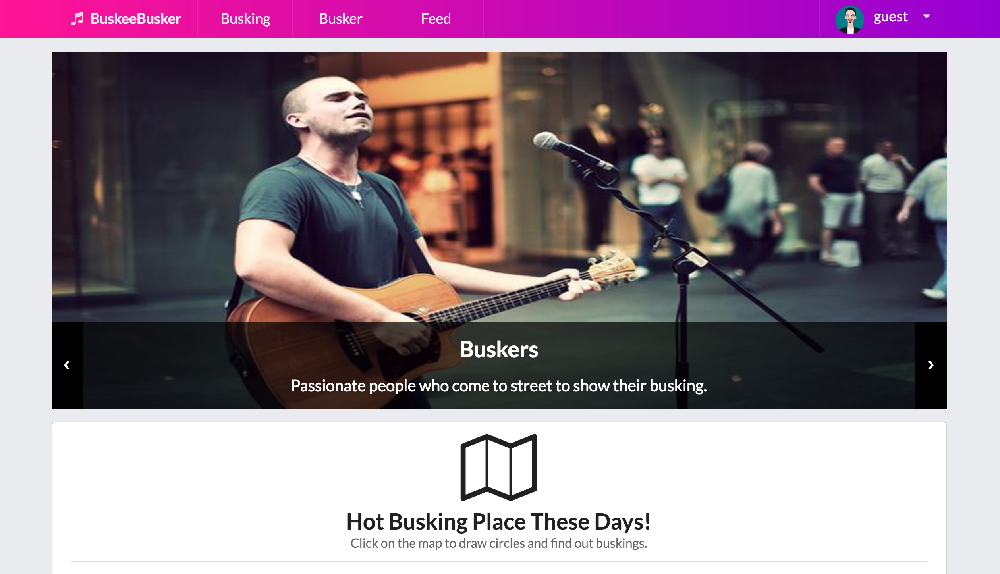

# [MC2] Team Buskee Busker

### Project repository for KAIST CS374

**Hyoungseok Kim 20140176**

**Kyung Je Jo 20130799**

**Seokchan Ahn 20140330**

**Eun-Young Ko (audit) 20090044**

## Demos

#### Demo Url: https://buskeebusker.github.io/BuskeeBusker

#### Demo Video: [https://youtu.be/QD1sxcsN1Pc](https://youtu.be/QD1sxcsN1Pc)

## What does it do?
Webpage to connect any buskees to buskers. Buskees can easily search for buskers, follow their activities, and receive information of other buskings.

## Available features
### MAIN PAGE
+ In the main page, you can browse through the map to see which buskings are taking place in specific location with a single click.
### SCHEDULE
+ Once you choose the date and location, BuskeeBusker offers all variety of buskings for the query. Buskees can get more information about buskers, time of busking, weather forecast, venue via Google Map. 
+ Don’t worry if you don’t know any buskers. Information about currently hot buskers and busking are also offered.
### BUSKERS
+ If you wish to search for buskers already in mind, BuskeeBusker offers you BUSKERS tab. You can select appropriate radio filters and search for your favorite buskers.
+ Don’t worry if you cannot remember some information about the busker. You will be able to find busker even with little information with hashtags.
### MY FEED
+ This is exclusive features only for logged-in users.
+ You can be up-to-date with your favorite buskers. Whoever you liked, the buskers’ feed will automatically update on your feed page.
+ You can make comments, or pin the feed to see them later in mypage. 
### MY PAGE
+ You can collectively see all pinned items in my page including feeds, videos and busking events.
+ Most significantly, you can see all buskings you pinned at one glance through calendar interface. 

## Code Structure
### All pages share same header navigation bar stylesheets and javascript.
+ header.js → handles redirections in header (and login)
### All html page has distinct javascript file which handles events in that page.
+ map_search.js → show famous busking place in the map and give information about buskings shown in the map.
+ schedule.js → initializes schedule table, chart for hot busker, hot busking
+ search.js → loads busker information from firebase and shows filtered result.
+ busker_info_each.js → loads all information, videos, upcoming busking of each queried busker
+ feed.js → loads feed of following buskers from firebase
+ mypage.js → loads all pinned items, and display them in each tab

