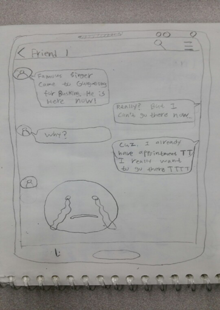
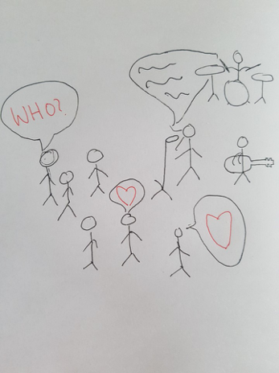
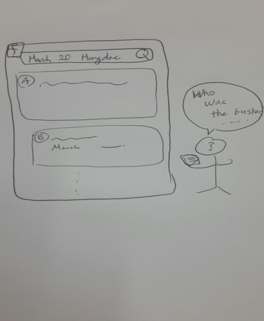
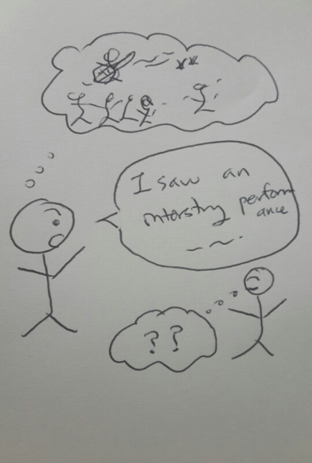
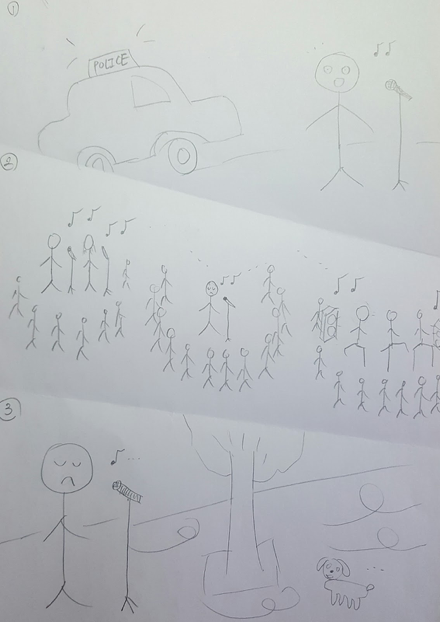

# DP1 Report  - Needfinding

### [MC2] Team Buskee Busker

**Hyoungseok Kim 20140176**

**Kyung Je Jo 20130799**

**Seokchan Ahn 20140330**

**Eun-Young Ko (audit) 20090044**

## 1. Experience
Redesign the experience of meeting between buskers and buskees.

## 2. Observations & Interviews
As we aim to redesign the experience of meeting between buskers and buskee, we tried to listen from both groups. Our team interviewed four buskee (interview 1 - 4) and one busker (interview 5).  We categorized buskee into two groups, active and passive. Active buskees actively searches for various busking and sometimes watching busking itself is their main purpose of visiting the venue. On the other hand, passive buskee happens to watch busking by chance. Out of four buskee we tried to look for one extremely active buskee, one active buskee, and two passive buskee. Due to time constraint, we could only interview one busker. However, the busker we interviewed has a lot of busking experience. Therefore, we are confident that we gathered very detailed and wide range of busker’s need from him.  

### 1) Observation & Interview 1

#### (1) Overview 
* Participant: Female undergraduate student who likes to watch busking.
* Interviewer: Hyoungseok Kim
* Why interviewed? : I chose to interview her because she represents a group of people who really like to watch busking.
* How recruited? : Examined pool of friends to find appropriate participant.
* Where interviewed? : Skype video call
* Asked what?
    * How often do you watch busking?
    * Do you watch busking by chance or by purpose?
    * Do you have any discomfort with watching or planning about watching busking?
* Interesting moment
    * When she talked about her frustrating experience about missing busking.
    * She couldn’t go to watch famous singer’s busking because she didn’t know that in advance.
    * She looked sad when she thought about the experience of missing that busking. 

#### (2) Narrative
````
Interviewer: Do you know what is busking and do you like it?

Buskee: I like to watch busking and I really like it.

I: How often and how do you watch busking?

B: I usually watch busking in Facebook videos. Sometimes, I watch busking in the road by chance. I couldn’t go for watch busking because there are not much busking in Daejeon.

I: Don’t you plan to watch busking in advance?

B: Sometimes, if my friends notice me about that in Kakaotalk.

I: Do you have any discomfort with watching or planning about watching busking?

B: Yeah, I have one experience related to that. When famous singer Jang-Bum-Joon came to busk in Gung-dong** **I missed that because I didn’t notice that early. My friend noticed me about that when the busking starts, but I couldn’t go there because I had other appointment already.
````
#### (3) Sketch


### 2) Observation & Interview 2

#### (1) Overview 

* Participant: Male undergraduate
* Interviewer: Kyung Je Jo
* Why interviewed?:  Searched for an interviewee with some experience of watching busking
* How recruited?: Random recruitment
* Where interviewed? : in-campus
* Asked what?
    * Share your experience in watching buskings
    * How often do you watch busking? Why?
    * How do you reach to busking places?
* Interesting moments
    * Interview was focused on extracting interviewee’s experience and approach
    * Usually, he encountered busking unexpectedly
    * He has no experience of searching for any busking - he pointed out methodological awareness
    * "I wish to watch more buskings, but I do not know when and where they perform" - interviewee*
    * "Sometimes, buskers were amazing and I wanted to learn about them" - interviewee

#### (2) Narrative
````
Interviewer: Hi, have you ever watched busking?

Buskee: Yes, I watched busking when I was walking by at Gangnam station.

I: What stopped you from walking?

B: Sometimes I become curious because there are a lot of crowds watching busking. Other time, it is either vocal’s singing or music that stops me from walking.

I: Do you watch buskings often?

B: Not really, even though I like to watch buskers performing, I only watch them when I happen to be at the place by chance.

I: Has watching busking been your main purpose of going to a place?

B: No.

I: Why not? Have you ever searched for busking in advance?

B: Though I like watching their performances, I am not the biggest fan of busking. Furthermore, I am not really sure how to search for busking venues and time. Sometimes I have free time and I wish to watch more buskings, but I do not know when and where they perform.

I: Have you ever took any follow-up actions after watching a busking?

B: No, but there was one time when my friend wanted to figure out busking group’s name. We were all amazed on busker’s performance and wanted to know about them. Since we could not stay until the end of busking, she tried to search for the name afterwards but failed. 

I: Why was that so?

B: She tried to search via facebook and instagram using various keywords including hashtags. However, the busker did not show up in any of the result set.
````
#### (3) Sketch


### 3) Observation & Interview 3

#### (1) Overview

* Participant: A man watching busking at Hongdae street, age 29
* Interviewer: Eun-Young Ko
* Why interviewed?: He was watching busking at the time I asked for an interview. 
* How recruited?: Among crowds. I explained our project and asked for an interview. 
* Where interviewed? : A street in Hongdae, Seoul
* Asked what?
    * How and why he was watching the busking. 
    * Do you watch busking by chance or by purpose?
    * Can you tell me any experience about discomforting situation related to busking?
* Interesting Moments
    * When he loves the performance of buskers, he wants to listen their song again. 
    * He write down the buskers’ name and follow their SNS (facebook), occasionally buy the album of buskers.
    * Sometimes he goes to watch busking of the performer he followed in SNS, when the pre-announced place and time work for him. 
    * The most inconvenience experience: Sometimes he loves the song of buskers but it is hard to know the names of singers and reach them again.

#### (2) Narrative
````
Interviewee: How did you get here (the place of busking, near Hongdae subway station)? 

Buskee: I was waiting my friend and started to watch this performance by chance. 

I: How often do you watch busking? 

B: I haven’t counted. I guess at least once a month. 

I: Do you watch busking by chance or by purpose?

B: Both. I sometimes go to watch busking of bands that I like, if the time and location works for me. By chance is more often. I just see or hear someone’s busking and spend some time watching the performance. 

I: How do you know busking schedule of bands that you like? 

B: By facebook. I follow 3-4 bands on facebook and they post their busking schedule on their facebook. However, usually time or location that they posted does not works for me. 

I: How did you get to know that bands? Are they popular? 

B:  I think so. When I see a busking and I like their performance, I try to write down the name of band, find their SNS page and follow it.  

I: Can you tell me about any discomforting experience related to watching buskings?

B: When I liked the performance of busker, as I said, I try to know their name or their song. Many buskers write down their name in front of the stage but there are some bands or singer who does not show any information about them. 

I: Why don’t you ask directly to the performer? 

B: It is hard to talk to them while they are performing. Moreover, I try to memorize the name of bands or singer but I often forget their name when I’m back home. Finding out the name of band is even harder than recalling their name. 
````
#### (3) Sketch


### 4) Observation & Interview 4

#### (1) Overview

* Participant: A graduate student living in Seoul, age 25
* Interviewer: Eun-Young Ko
* Why interviewed?: He is friend of mine who loves music a lot, especially songs from indie bands, and watching buskings. 
* How recruited?: Directly called him and asked for an interview.
* Where interviewed? : By phone call.
* Asked what?
    * How often and when he watches the busking. 
    * Do you watch busking by chance or by purpose?
    * Can you tell me any experience about discomforting situation related to busking?
    * Any suggestion for website that helps buskees? 
* Interesting Moments
    * He loves watching busking, especially when the performer (or group) is very unknown group/singer. 
    * He tries to support indie band/ unpopular band with great talent but it is hard to reach them. 
    * He wants to share impressive buskers’ performance with his friends who shares same interests - music, indiebands. However, it is hard to deliver my impression, especially when he cannot reach the buskers’ information. 

#### (2) Narrative
````
Interviewer: How often do you watch buskings? 

Buskee: It depends on my schedule. When I was a undergraduate student, I went to Hongdae street very often, and watched buskings at least once a week, I guess. However, in these days, I can go watch buskings less than once a month.

I: Do you watch busking by chance or by purpose?

B: Both. When I went Hongdae very often, I watched busking a lot by chance. However, in these days, I intentionally go to see busking of my favorite bands. 

I: Can you tell me a name of your favorite band and how did you get to know them. 

B: ‘쓰레기스트' and Soundbox. I saw them busking by chance, few years ago, and found their performance are very impressive. I just followed them in their SNS. Both of them were not popular when I first followed them, however, they are one of the most popular performance team nowadays.  I still go and watch them performing sometimes. 

I: What if you want to go watch your favorite band but the schedule does not work for you? 

B: I just watch their performance video on their facebook but they rarely upload their performance.

I: When you go Hongdae often, is the purpose of visiting Hongdae is watching busking? 

B: Busking is never a sole reason for my visit to Hongdae, however, that busking culture makes me go Hongdae more often. I can see new bands or performance teams busking in hongdae and some of them have great talent. Then I follow them again.

I: Can you tell me about any discomforting experience related to watching busking?

B: When I see very impressive performance, I try to remember the name of band but it is hard to recall their name when I’m back home unless I wrote down their name during the performance. Moreover, I sometimes want to share my feeling or impression with my friend, who loves the performance that I love too, but it is really hard to deliver the feeling or atmosphere to him. The worst case is when it comes together. I want to talk to my friend about one performance the I enjoyed but I couldn’t even imagine what is the name of the band. 

I: Me and our team are planning to design a website that can help watch busking. Do you have any suggestion?

B: Well… (some comments on schedule, searching..) I wich I could find out more interesting bands on the internet. Especially, I like band performance with some extraordinary part, for example funny dancing, or unique costume. I want to know more bands like Soundbox or ‘쓰레기스트'. 

I: How do you find that ‘interesting bands’ that you described currently? 

B: There exist two ways. I met them busking in the street, totally by chance. Otherwise, my friend talks to me about interesting band they saw on the street. There is no other way. 
````
#### (3) Sketch


### 5) Observation & Interview 5

#### (1) Overview

* Participant: male weekly busker who likes to do busking
* Interviewer: Seokchan Ahn
* Why interviewed? : because he has a lot of busking experience
* How recruited? : He did busking with my sister at Hong-dae street
* Where interviewed? : Phone call
* Asked what?
    * How often do you do busking?
    * Is there a helping site for busking?
    * What is the problems about doing busking?
    * How do you advertise yourself and your busking?
* Interesting moments
    * I interviewed him and focused on process of and problems about doing busking.
    * He do busking weekly and usually do at Hap-jeong.
    * He said he likes to doing busking and he use ‘busking play’ to reserve a place when weather is bad
    * He cited the buskers’ anxieties as three major problems.
        * 1. city petition
        * 2. noise from other buskers
        * 3. regional flow population
    * He said that if busker had a short period of busking, s/he would have difficulty in advertising, and most of them use facebook for advertising themselves.

#### (2) Narrative
````
Interviewee: Please tell me about yourself.

Busker: I am Jin-woo Ha. I am a busker, and I love busking.

I: Do you do busking alone?

B: I did busking as a group in the past, but now I do busking as a solo. But soon I will form a group to do busking with.

I: How often do you do busking?

B: I do busking weekly at Hap-jeong.

I: Is there any apps or service you use when you do busking?

B: I use a service called ‘busking play’ to make reservation for busking place. However, I go out busking without using the service when the weather is good

I: Then, is there any reason to use ‘busking play’?

B: Because when I do busking, I get a lot of complaints. However, when I do busking at reserved location from ‘busking play’, I am free of all complaints since the locations from ‘busking play’  are authorized. That allows me to make a safe and comfortable performance by contracting with a company in advance

I: If buskers have concerns, what are they?

B: A city petition. As I mentioned before, there are a lot of complaints from local residents. Sometimes there are cases where residents report even when I am performing in authorized places. And the surrounding noise is a big concern. Especially in Hongdae, there are too many buskers which bothers me from performing well. You can’t say they are music when all buskers’ noise overlap. Finally, there is a concern with population flow. I am worried that not many people would come if the population flow is too low. So when I do busking, I choose a place with a big population flow.

I: Aren’t you worried about the song? For example, if I am a busker, I will be concerned about how listeners feel about my singing.

B: I don’t worry about the song. Most of buskers have pride of their singing.

I: Then, Have you ever worried about promoting yourself or the group?

B: I have been busking for a long time, so now I am not worried. There is a fixed fan base in the team that has long busking, so there is no problem in publicity, and even if they do the ‘spontaneous busking’ (번개 버스킹), there are quite a lot of people. In contrast, for the busker with short history, they will have a lot of trouble. Oh, but I'm still worried. Because promotion channel is very limited to Facebook, but I also wish to promote people who are passing by.

I: Thank you, If you have anything to say, please do so.

B: I want to shoot my busking show. I want to shoot more professionally and promote myself with it. However, There is a problem of manpower and equipment. Furthermore, there is no willingness to do so because only the people who come today come tomorrow.

I: Thank you!

B: Thank you.
````
#### (3) Sketch


## 3. Needs (Total 12)
I# in parentheses means that the need is derived from particular interviewee

### (1) Needs from buskees - I1, I2, I3, I4

#### 1. WHEN and WHERE (for both of active and passive users)
    
    1. Information of busking venue/time in advance (I1, I2, I3, I4) 
    
    2. Easy tracking of busker’s schedules - especially for sudden change in schedule (I3)
    
    3. Notification/Alert for upcoming performance of busker that buskee loves the most (I1)
    
    4. Information on nearby, real-time busking performance (I3)

#### 2. WHO and WHAT (for active users)

    5. Recommendation/Ranking of buskers (I4)

    6. Searching busker’s information (name, SNS,.. etc) based on time/venue of their past performance (I2, I3, I4)

    7. Better methods to share the performance with other friends (I4)
    
### (2) Needs from buskers - I5

#### 3. Quality of Busking

    8. Avoid conflicts with other buskers on venue and schedule (I5)

    9. Avoid civil complaint from nearby residents. (I5)

    10. Increase exposure/publicity to people (I5)

#### 4. Promoting

    11. Information on possible busking place (I5)

    12. More promotion channels or more fans (I5)

## 4. Insights (Total 11)

1. Connection between buskers and buskees - we should include both

2. Providing all buskers’ schedule at one glance (by time/venue/group)

3. Dynamic updates on any change regarding busking

4. Active evaluation/feedback from buskees

5. Providing real-time GPS-based busking places

6. Providing searching method to find a specific busker based on buskee’s experience

7. Recommendation of buskers according to buskee’s preference

8. Access to real-time busking via streaming or previous videos of buskers

9. Providing information on good busking place to buskers

10. Efficient promotion channel for buskers

11. Solving the "inter-busker" conflicts with venue or time

## 5. Studio Reflections

### 1) "Likes" Feedback

(1) Team’s approach that attempts to find needs from both perspective of buskers and buskees is great.

(2) Sketches are nice and it represents the content well.

### 2) "Wishes" Feedback

(1) Currently, buskees use SNS a channel of gathering information on various busking. However, the structure of SNS is not optimized to buskee’s needs such as in the feature of showing schedules of busking.  It would be helpful for the team to give attention in improving the current UI of busking information in SNS.

### 3) Our reflection

We tried to catch as much needs as possible regarding busking performances. That’s why we analyzed from two perspectives, one from buskers’ and the other from buskees. We are delighted to get "Likes" feedback from that point. To reflect “Wishes” feedback, we are going to investigate the current SNS information gathering process. To be specific, we are going to visit SNS like facebook and twitter first. Then, we will find popular busking pages or busker accounts that a lot of followers. Finally, we will analyze the UI of the posts related to busking schedules. We hope we would catch the current UI problem in SNS and come up with better idea to meet the needs. 

Below we present our first observations on busker’s SNS use. In most cases, buskers use their SNS page to announce their schedule in advance, notify sudden change in schedule or cancellation. It seems that there exist some limitations on current way of how buskee and buskers meet each other. Most importantly, only buskee following a busker’s SNS can know the busker’s performance schedule. Another channel that can gives busking information to active user searching for a busking to watch or passive user near busking place would be beneficial to both buskee and buskers. In addition to that, in case of sudden change or cancellation of busking, buskers worry a lot about buskee coming to their performance. However, what buskers usually do is writing a post about change or cancellation and therefore there exist some buskee making a trip for nothing. We also tried to find a band’s facebook account based on their busking time and venue, however, getting the information was extremely hard as the facebook search result highly depend on ‘keyword’. For example, if the date is ‘March 17’ on busker’s facebook post, we cannot find their post by searching with keyword ‘3/17’.
