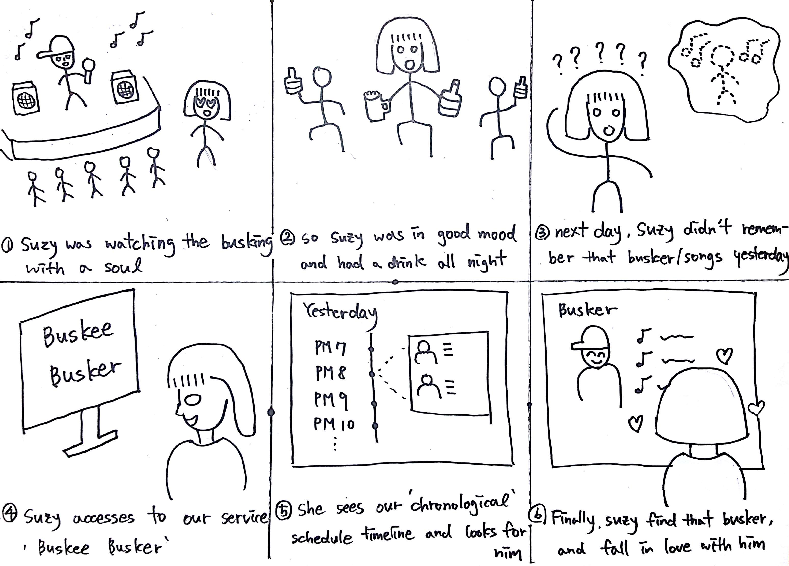
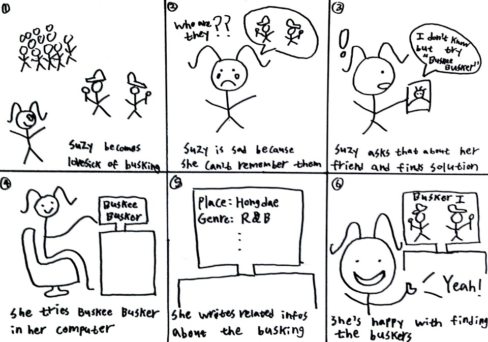
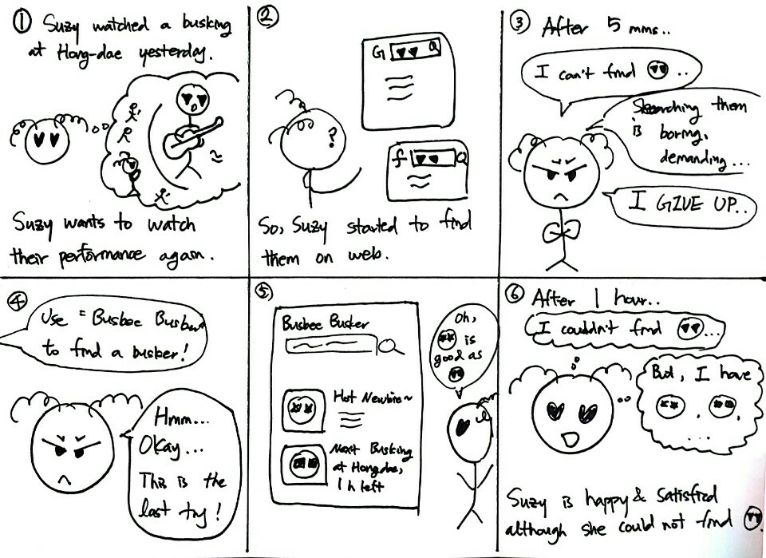

# DP2 Report  - Ideation

### [MC2] Team Buskee Busker

**Hyoungseok Kim 20140176**

**Kyung Je Jo 20130799**

**Seokchan Ahn 20140330**

**Eun-Young Ko (audit) 20090044**

## 1. POV
A buskee who incidentally became a fan of a busker by watching the busker’s busking by chance. The buskee wishes the information on busker and its songs easily accessbile at anytime. Though the buskee has enjoyed the busking fully, it was difficult to remember the information about buskers and the songs and only the impression was lasting. This POV is unique and non-trivial one we extracted from our interviews. It is surprising that buskees easily forget the name of busker even if the buskee enjoyed the busker’s performance a lot.

## 2. Persona
### 1) Demographic information

* Name: Suzy
* Gender: Female
* Age: 23
* Occupation: undergraduate(in seoul), single
* Motivations: Likes listening to music, atmosphere of the street.
* Beliefs: Carpe Diem!
* Preferences: Indie band, new artist
* Goals: Watch buskings that her favorite buskers performs in the street. Construct a perfect playlist of songs that she loves.

### 2) Story
 

On Suzy’s birthday, she was walking on Hongdae street feeling tipsy and stuck to a R&B busking by chance. She fell in love with that busking and promised to herself  to add its songs on her playlist.  After she went home, she tried to remember the busker and the songs. However, Suzy couldn’t remember the busker and her further attempt to find the information about the busker online failed. The other day, she returned to Hongdae street, feeling nostalgic for that busking in her mind.

## 3. HMW questions for POV
* HMW allow buskees to find busker’s song easily?
* HMW remove buskees’ burden of having to memorize the busking information?
* HMW make busking easier to remember?
* HMW make buskee memorize that busking?
* HMW make detailed information of buskers easily searchable?
* HMW design the ‘searching the busking information’ entertaining instead of painful even if buskees cannot find information? 
* HMW help buskees to improve their memory in general? 
* HMW make buskees does not miss the busker? 
* HMW encourage buskee to make a record (writing or picture, etc) of busking on the spot?
* HMW increase the probability of encountering the same busker when buskee revisit the same place? 

## 4. Top HMW questions and how

From our POV, we extracted two important parts, memorizing and searching.  HMW questions should be extracted with those two important parts kept in mind. Thus, we tried to pick HMW questions that can remove or solve difficulties regarding these two parts. Also we picked HMW questions with proper scope. Which is not too broad or not too narrow, and which is problem-driven, not solution-driven. Finally, we checked our questions are mutually exclusive (and collectively Exhaustive)

### TOP 3 HMW questions
* HMW remove buskees’ burden of having to memorize the busking information (busking schedule, busker’s name, songs, etc). (Remove the bad/Question an assumption)

* HMW make detailed information of buskers easily searchable (Change a status quo).

* HMW design the ‘searching the busking information’ entertaining instead of painful even if buskees cannot find information (Go after adjectives).

## 5. Solution ideas for HMW questions
### Solution 1
1. Provide Q&A board buskee and busker.
2. Crowdsource of schedule. (manual fill-in)
3. Provide a QR code for each busker so that buskee can take photo.
4. Notify when user is watching busking. (GPS based)
5. Make bukser report their busking informations.
6. Get Information from other buskers who watching that busking.
7. Make buskee note informations after they watch busking.
8. Provide quiz contest which ask what was that song at that busking.
9. Provide 1:1 (busker-to-buskee) chatting service to get past information.
10. Make a board which buskees provide some information about buskings.
### Solution 2
1. Put busking places to digital map and provide related information when user clicks on map.
2. Share busking information that buskees have reported to public.
3. Sort busking events with various tags to enable buskees to find favorite buskings efficiently.
4. Make place to upload question about busking and receive answer from crowds.
5. Employee people who can answer to busking-related questions.
6. Make place for buskers to promote themselves efficiently.
7. Make buskers to upload their information or schedules regularly.
8. Make buskers to upload their videos on searchable streaming site like youtube.
9. Make buskers to become famous by hosting TV shows.
10. Make designated place where buskers and buskees usually gather and share information.
### Solution 3
1. Present related busking videos (by band name, location, genre).
2. Make buskees get point from just searching a busker and provide ranking over them. 
3. Make a system with Hopscotch-like design that buskees collect buskers in order to enlarge their area.    
4. Provide tips from other buskees on how to enjoy buskings. 
5. Present extra information that the buskees may enjoy, such as snippet of popular busker, suggestion of similar songs, or special events related to buskings. 
6. Provide a system that suggest busker that one might like by collecting some data from buskee (like “VonVon”). 
7. Make buskee searching for a busker can join a group of buskee that shares similar interest or favor so that they together enjoy communicating with each other.
8. Make another buskers with detailed information to be seen  more attractive so that buskee fall in love with this new band instead of one was in her mind. 
9. Connect buskers and buskee so that other buskers can come and contact the buskee who is finding a busker, in order to advertise themselves. 
10. Make a platform where the search action is similar to existing system like google or facebook, but the search result only contains busking related information. 

## Top 3 solution ideas and how
Among 10 solution ideas for each of 3 HMW questions, we tried to pick solutions that can can effectively account our HMW questions. The applied two criterias for selecting Top 3 solutions. Firstly, we considered actual benefits that users will get from the solutions. Solutions with more benefits should be prioritized than others. Secondly, we considered our team’s ability to implement the features. Even though some solution ideas are awesome, it those solutions are almost impossible to implement, then it’s hard to make the product at the final. We considered these two criterias and picked 3 solution ideas as below.

### Top 3 solution ideas
* Provide chronological schedule of busking in various busking venues
* Sort busking events with various tags to enable buskees to find favorite buskings efficiently.
* Present extra information that the buskees may enjoy such as
  * snippet of popular busker
  * suggestion of similar songs (genre, busker ...)
  * special events related to buskings

## 7. Storyboards

### Solution Idea 1
Provide chronological schedule of busking in various busking venues

#### Story
Suzy was watching the busking with a soul. So suzy was in good mood and had a drink with her friends all night as her belief, Carpe Diem. Next day, suzy woke up and tried to feel nostalgic of yesterday again. However, suzy cannot remind that busker and songs. Then, Suzy accessed to our service, ‘Buskee Busker’. And she saw our chronological schedule timeline and looked for him. Finally, suzy find that busker and fall in love with him in mood of  yesterday.

### Solution Idea 2
Sort busking events with various tags to enable buskees to find favorite buskings efficiently.

#### Story
One day, Suzy went to Hongdae street and incidentally watched busking on the street. After she watched busking, she became lovesick of busking. However, when she came back home, she couldn’t remember them. So she asked her friend Alex whether there is a way to find information about busking. Alex suggested her to try “Buskee Busker” to find them. So suzy tried Buskee Busker in her computer. She wrote the place and genre of busking and submitted it. Finally, she could find the the buskers and she became happy because she could go for watching them again some day.

### Solution Idea 3
Present extra information related to busking that the buskees may enjoy

#### Story
Suzy went to Hongdae street and incidentally watched busking on the street. After she watched busking, she became lovesick of busking. Next day, Suzy strated to find them on web like google or SNS like facebook.  However, when searched the busker based on these system,  it shows a lot of irrelevent searching result and Suzy get tired. After 5 minutes, Suzy just give up to searching them. On the next day, one fo Suzy’s friend told her to use “Buskee Busker” to find a busker. The website Buskee Busker shows many interesting busking-related features. Currently popular busker, Information on upcoming busking performacen, etc.  With this interesting features, suzy finds out that searching itself is interesting. As a result, suzy will be happy even if she could not find the busker that she wanted to find.

## 8. Studio Reflections
### “Likes” Feedback
1. Topic of solving problem related to busking is interesting.
2. Well organized problem as memorizing and searching problem.

### "Wishes" Feedback
1. Real-time location saving feature would help. For example, if buskees approaches busker, automatically save location and sync it with busker information.
2. Some solutions like third solution might be hard to implement . It would be hard to implement suggestion of other information to users

### Our reflection
As we investigated the needs and insights from our users we defined our problem as memorizing and searching problems related to busking events. We are happy to get positive feedbacks for our decision.
For real-time service in “Wishes” feedback, we have considered it when we first brainstormed about solutions. We agree that this feature would be really helpful to user to solve both memorizing and searching problem. So we are going to think more about if this feature really helps users and figure out if this feature is possible to implement.
For the final feedback, we also agree that it’s hard to implement suggestion algorithm in backend system. So, if we are going to implement this feature, we will first try paper prototype to test usability of the function. Then, we will make Wizard of Oz prototype to just implement relatively easy computer frontend part and mimic our backend part with human. We think it would help to lessen the burden of implementing difficult backend logic for prototypes.
