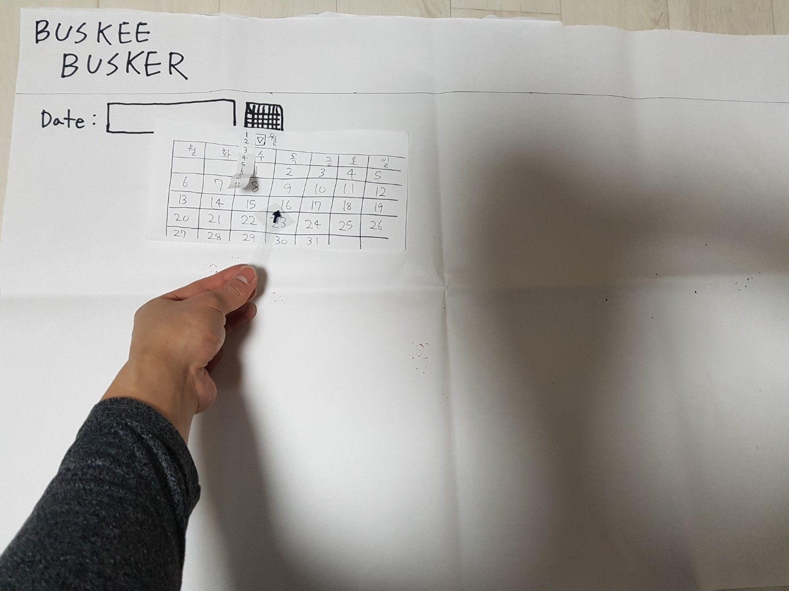
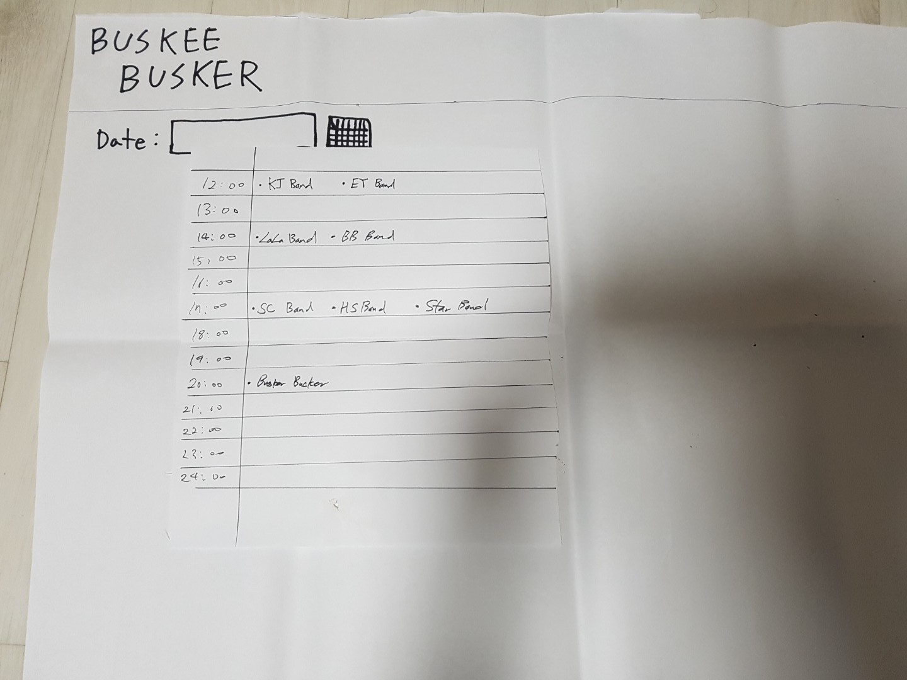
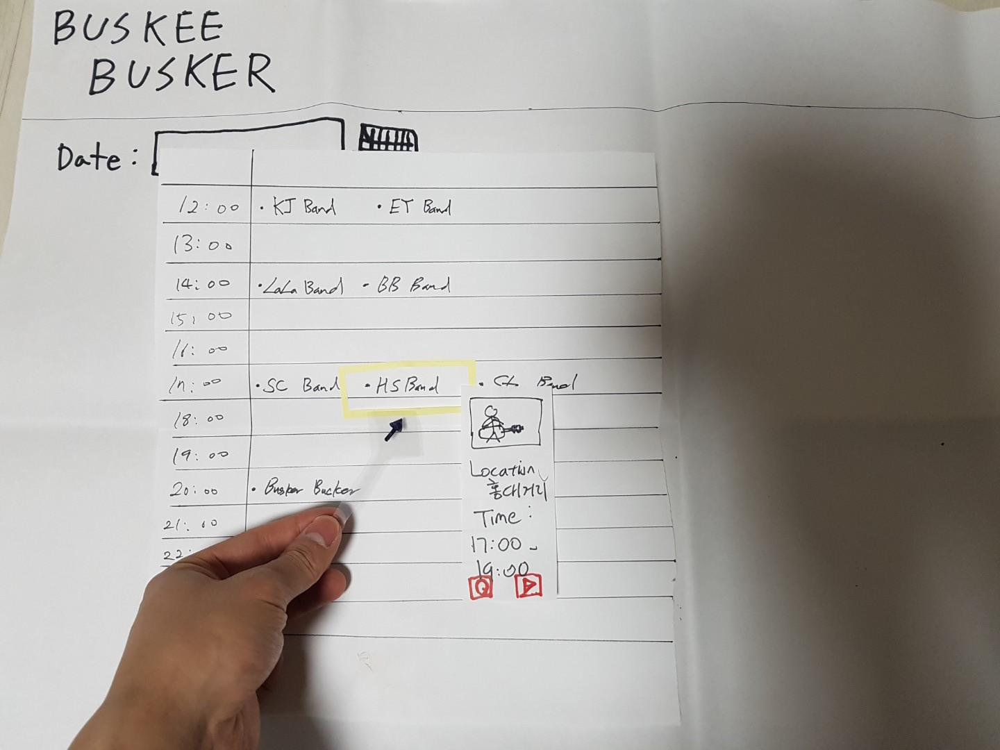
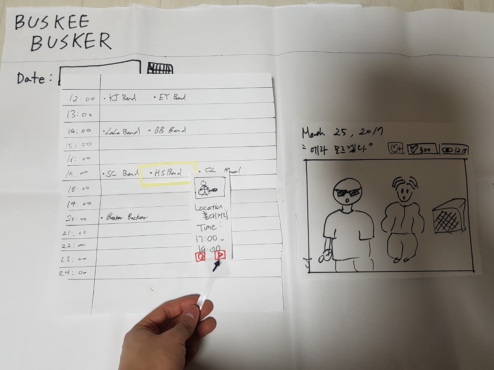
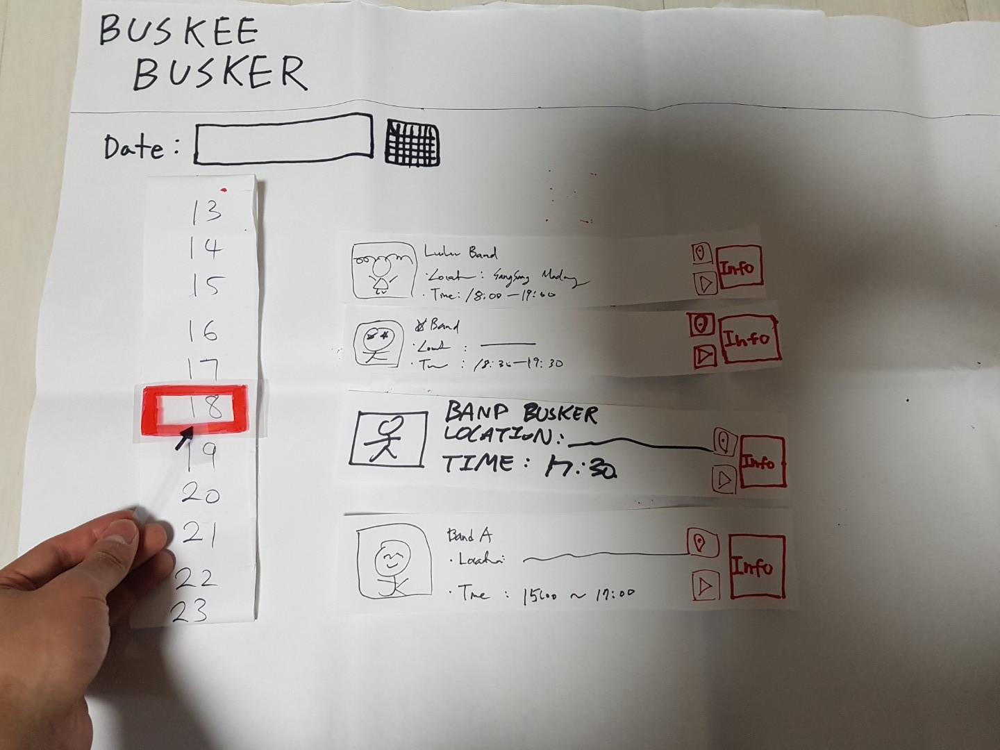
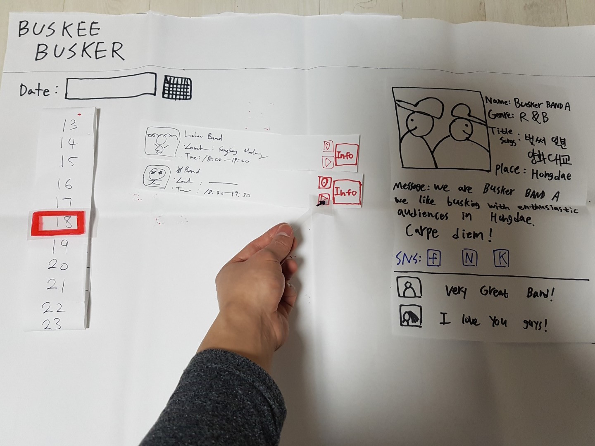
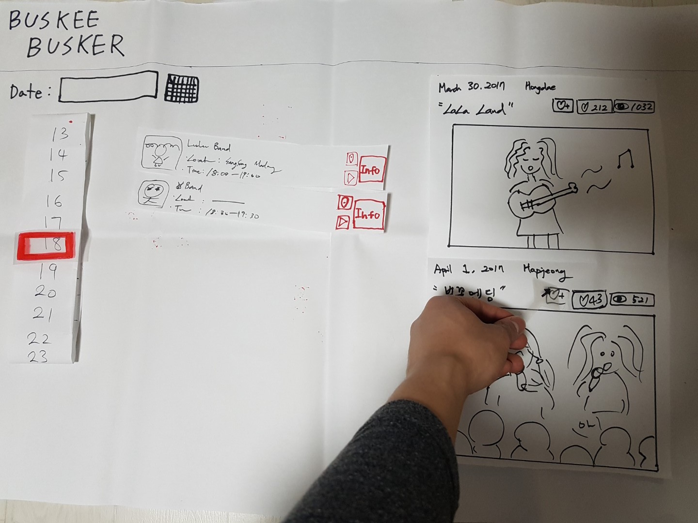

# DP3 Report  - Paper Prototyping

### [MC2] Team Buskee Busker

**20140176	Hyoungseok Kim**

**20130799	Kyung Je Jo**

**20140330 	Seokchan Ahn**

**20090044 	Eun-Young Ko (audit)**

## 1. Photos of Prototype
Our paper prototype is designed to provide chronological schedule of busking in various busking venues, which is the first solution idea from DP2. 
1. In the initial state, the user will firstly select dates to see the full schedule of busking.

2. Then user can see the full schedule of the selected date.

3. As the user hover a specific busking, the user can access to information on location provided by a map on the right.

4. The user can simply access to the videos of busker’s previous performance by clicking play button.

5. On a specific date, the user can also choose to search various busking by time.

6. The buskings that are played at same time slots will be showen. The user can find more information on any busking in the time slot by clicking a button.

7. The user can watch buskers’ previous busking and press likes to a specific busking performance. As the user clicks on the like button, “heart”

## 2. Participants 
We experimented our paper prototype to 3 participants. All of the three participants are students who like to watch busking. 

### 1) Buskee1
* One Line Description:
	Buskee who loves busking, but have no experience of watching busking in Daejeon.
* Demographic:
	* Gender: Male
	* Age: 27 years old
	* Occupation: Graduate Student in KAIST
	* Residence: Daejeon, Seoul
* How did you recruit:
	* Recruited after directly asking him whether he likes busking. He said he likes busking, so our team chose him as the first user.

### 2) Buskee2
* One Line Description:
	Buskee who was an ‘Indi Street’ application user, which is the Hongdae busking information provider.
* Demographic:
	* Gender: female
	* Age: 23 years old
	* Occupation: Undergraduate
	* Residence: Daejeon
* How did you recruit:
	* Asked to friends to recommended with who likes watching busking. A friend introduced her as a frequent buskee.

### 3) Buskee3
One Line Description:
	Buskee who wants to do busking in the near future.
* Demographic:
	* Gender: male
	* Age: 22 years old
	* Occupation: Undergraduate
	* Residence: Daejeon, Busan
* How did you recruit:
	* Searched for someone planning to do busking in KAIST “SIXline”, KAIST intramural guitar band group.

## 3. Briefing
The purpose of our service “Buskee Busker” is to provide information of various buskings to buskees. Information includes schedules of buskings, buskers themselves and related information to those buskers. Our background for developing the service is that buskees usually have hard time memorizing and searching their favorite buskers. Most buskees that we interviewed said that it’s hard to figure out information of buskings and buskers after watching buskings in the street. Therefore, we are trying to solve these problems with our service “Buskee Busker”.

## 4. Tasks
* T1: Choose a specific date to view overall busking schedule for the day. 
* T2: Select a specific hour to check busking schedule for the time. 
* T3: Check detailed information of each busking (busker information, busking location and busking video).

## 5. Observations
We observed user testing process from three users and derived usability issues from them. There were total 11 usability issues in the process and we analyzed them by giving critically of High, Medium and Low. We used three standard criteria, which are written below, to determine criticality.
* Criticality criteria
	* How many participants mentioned a function? 
	* How much do other functions affected by a mentioned function?
	* How can issues in POV be better tackled by a mentioned function?

### 1) Usability Problems

*P# means #th participant introduced above.

* Task 1
	* High: There is no default information when the user enters the page. (P1, P2, P3)
	* Medium: Hard to schedule when there are too many buskings at the same time. (P2)
	* Medium: There is no function that buskee search by  location, when he checks busking schedule (P1, P3)
	* Low: There is no date selection option for previous years (P2)
* Task 2
	* High: The schedule shows buskings that starts at selected time, not buskings that started before and performed continuously. (P2, P3)
	* Low: The time slider shows redundant hours like 4 a.m, when no buskings are performed. (P3)
	* Low: All-night busking information is not shown clearly because it is splited in 2 days. (P1)
* Task 3
	* Medium: The right section looks very bare when no busker is selected, because detailed information is shown only when a specific busker is selected. (P3)
	* Medium: There is no sort option for busking video while he wanted to see vedio by popularity. (P1) 
	* Low: Detailed information page did not show text input field to write reaction (P2)
	* Low: There is no comment line that buskee can write their feeling about the busking video. (P1)

### 2) Plan to improve

For each tasks, we defined criticality for each usability issues with the level High, Medium and Low. As higher level of criticality means higher importance to our system, we are going to solve higher level criticality issues first. For example, for task 1 we will firstly take care of the issue that “There is no default information when the user enters the page”. We are going to set default information when user first enters our service to overcome the usability issue. After completing it, we will solve next Medium level issues and finally we will end up solving Low level issues to cover most of the reported usability problems

## 6. Individual Reflections
Since we have many windows and features in our prototype, we distributed roles as 2 computers, 1 facilitator, 1 observer. 

### 1) Hyoungseok Kim 
* Role: Observer (R1, R2), Facilitator (R3) 
* Difficulty
	1. (Observer) I think determining the important part of the observation was difficult for me. When I wrote all the observations in a paper manually, it was hard to know which part was actually important for us. It might have been better if I had concentrated only on ‘critical’ incidents,
	2. (Observer) I had difficulty of memorizing exact context of ‘critical’ incidents. As this was the second time working as observer, I tried to concentrate on ‘critical’ incidents. However, it was hard to remember the contexts for a few ‘critical’ incidents because I couldn’t write down all the observations. Thus, I think it would have been better if I had recorded the audio or video of testing process so that I can concentrate on reporting ‘critical’ incidents without losing contexts.
	3. (Facilitator) It was hard to determine whether I should give explanation when a user was stuck in somewhere. If I give him full information every time, I will actually lose potential usability problems. On the other hand, if I let him to keep struggling with one part, then it will take too much time to do full testing process. As there were a tradeoff between these two approaches,  it was difficult to balance between them.

* Pros of paper prototype
	1. I think rapidity of the paper prototype helped us to conduct user testing in early stages. Before using the paper prototype, I always conducted user testing when I implemented some of the functionalities  programmatically. As it took too much time to wait for the implementation of those functionalities, I had to wait for a long time to do actual user testing. However, paper prototyping reduced the waiting time because it can be generated only in a hour.
	2. Disposability of the paper prototype also helped us to modify problematic user interface easily. When I used computer prototypes before, it was hard to modify the coded user interface because it already cost me a lot of time. However, with paper prototypes, I could easily modify the paper-drawn user interface by just discarding it and then drawing it again.
	3. Finally, paper prototype was useful in that all members in our team could draw and integrate exact pictures of the system in their mind. If we develop our system without using paper prototypes, all of our team members will have slightly different view for the interface of our system. However, as we draw paper prototypes at the early stage, it helped us to integrate our picture of the user interface and then focus on unified goal.
* Cons of paper prototype
	1. I think the paper prototype couldn’t give much interactivity to a user because it depends too much on human who has a role of a computer. Unlike the computer prototype, the paper prototype should provide functionality with human’s manual help. Compared to computer actions, human’s action usually takes much more time to do some tasks. Thus, in our user testing, human computer’s slow reaction inevitably lessened the interactivity in user testing.
	2. Hesitance of user was another cons of paper prototype. As it takes too much time for the human computer to do some tasks, human computer will be overloaded if there are too much user actions at the same time. Therefore, when we conducted our user testing, a user showed a sign of hesitance for pushing different button in a short interval. It was because he thought that he would harm the human computer if he pushes the different buttons too fastly.
	3. Finally, the low fidelity for look of the paper prototype affected our user testing negatively. As our user interface components are usually on the flat page, it was hard for a user to know the function of each component at a glance. For example, a user couldn’t find a button for a particular task because that button couldn’t give exact sign for ‘pressable’ state. Even though he could find the button with our explanation at the end, it might have been better if he could find the button at a glance with better level of fidelity for look.

### 2) Kyung Je Jo
* Role: Facilitator (R1), Computer (R2, R3)
* Difficulty
	1. (Facilitator) Despite thorough discussion with teammates on how users will approach each windows in our prototype, the user’s actions often surprised me. Even with consideration that, to some extent, the buttons on paper may not reflect external consistency with real computers, users often became curious on what would happen by clicking a button or not realize it as a button at all. Moreover, it was hard to stay silent when the users were taking actions that our team did not expect such as not going into our second window - which showed organized busking schedule by time slots. 
	2. (Computer) Helping the team prototype as a computer was a new challenge which I have never experienced before. Firstly, since it was my first time taking a role as a computer, I could not predict the user’s upcoming action. As a team, we developed our paper prototype considering the user’s chronological actions. However, in real life, the user was not taking actions in the order we wanted. For example, we thought a buskee would look for a specific busker in mind to search for, so we predicted the user would click on a busker and look for that busker’s information. However, the user casually searched for new buskers wishing to find more about buskers who he did not knew.
	3. (Computer) Though, I became slightly better at being a computer after my first trial, keeping up the speed with user’s action still remained as a challenge. The user was requiring a faster and more accurate response from the computer. Even though user sometimes overlooked some of our buttons which our team put a lot of efforts in, it was difficult not to say a word. 
* Pros of paper prototype
	1. Prototypes can be developed cost and time effectively. Our team was able to generate about 10 windows (some being subtle changes of others) in just two class-times - about 90 minutes. Though we were not to pay for any materials, the prototype was produced mostly with paper and basic stationery. 
	2. Portability. Since paper prototype is light in weight and can run without access to internet, I believe it is highly portable. This allowed us to bring prototypes from E11 to anywhere. Each windows and feature was also easily displayed or removed just by moving our hands. 
 	3. Time to merge team’s idea into physical being. Though the team has not changed the main idea since DP1, it does not guarantee that all teammates are on the same line. As we were building prototype, we were able to understand what each other was having in their minds. As we agree and reject each other’s idea, we could reach to a compensation point to produce the prototype.
* Cons of paper prototype
	1. Lack of external consistency. The buttons did not look real and listviews do not seem to provide hovering feature; however, our prototype provides them. The users sometimes encountered difficulty in choosing the right position to press. Significantly, hovering of our listview of busking was easily overlooked. 
	2. Limited number of contents. From a paper prototype, contents were limited, to the size of a paper or post-its perhaps. This is a negative side of paper prototype since users are likely to find the prototype unreal. The users became curious how the busking schedules would be displayed when there a multiple sets of busking.
	3. Feedback in terms of speed and display. Computers in paper prototype cannot be as fast as the real computers. Thus, it is inevitable that users get late feedback from their action. Moreover, the display of feedback such as highlighting, breadcrumb, or progress bar could not possibly seem realistic in papers. The tested users found our computers slow and sometimes less accurate.
	4. Difficulties in editing the prototype. If it was written in html and css, it would be easier to modify the display. However the paper prototype does not allow simple modifications. If we were to modify a table in the paper, we would need to remake that paper.

### 3) Seokchan Ahn 
* Role: Computer(R1, R2), Observer (R3)
* Difficulty
	1. (Computer) When participants do something wrong, I can’t do anything to help. Because there is no way to display error messages to user. Also the output depends on user’s input, however the outputs from paper prototype were not fully matching. Even role of facilitator is helping user, it was mentally difficult because I think human computer’s role is communicating with user by computer outputs.
	2. (Computer) Since our users are not ‘professional’ for user testing, they sometimes act during I set some paper prototypes. It is hard to set pages as fast as user’s interaction speed because default page of our paper prototype is almost empty. Even our facilitator advice to user act slowly and user act slowly after listening that advice, we cannot test previous pages deeply. Thus it is important to change the windows fast enough for some components.
	3. (Observer) I tried to write only about ‘critical’ incidents. However, meaning of critical is not exactly the same with others. Also I didn’t note some points when I noted some previous incidents.  So some of incidents are missed and we remind that after user testing together. Video or voice recording is one of the solutions to solve this problem.
* Pros of paper prototype
	1. We could learn that user has a specific goal such as searching ‘yesterday’ busker when user access to our service. Thus we have to add some direct features (ex. ‘Yesterday’ button in data select box) to make user feel more comfortable. 
	2. We could know user can use its in mobile environments. If they feel great when watching busking, users can access to our service at that time. It means we have to focus more about real-time searching experience such as location based.
	3. We could know priority of extra informations. In our service, we have many buttons to see extra busking information. In this process, we ordered that buttons with our own priority. However the priority of users is different with ours. This results can be used in our different functions.
* Cons of paper prototype
	1. User couldn’t feel backend delay. However our prototype needs many queries to DB or internet (using map api and load youtube videos), so we have to consider about timing of components’ loading. Thus we were not satisfied with our user testing.
	2. Since we only focused on the most important feature in our project, we could not show other functions and interactions between functions. It is important to us because the common user’s end-to-end process is searching and sharing or memorizing. So interactions between process is needed to be tested.
	3. It is hard to test mobile experiences. Before we have user testing, mobile was a ‘bonus’ for users. However users need mobile more than our expectation. Also, in mobile web development, we have to re-design to fit mobile user experiences. Thus it is cons of our paper prototype that we didn’t consider about mobile environment.

### 4) Eun-Young Ko 
* Role: Computer (R1, R3), Facilitator(R2)
* Difficulty
	1. (Facilitator) Determining the timing of ‘cut-in’ was difficult. When participants tested our system, all of them sometimes wanted to perform an unexpected function which is not built in our prototype. These kind of events worth observation as a critical incidence. However, I have to cut-in users unexpected tries in order to continue testing our prototype. Guaging the proper timing to interfere was not easy.
	2. (Facilitator) As discussed in observation part, our paper prototype had no informative main page. I realized that it is hard to ‘Instruct participants well’ when the prototype has such critical flaw. 
	3. (Computer) Participants touch, scroll our paper prototype much faster than we expected. It was hard to give users instant feedback was demanding. However, this problem will be resolved after we actually implement our system. Also, as will be mentioned below, working as a computer when not all of the elements are prepared was a bit confusing. 

* Pros of paper prototype
	1. By making a paper prototype, we could end up with more concrete functions, design, or tasks than before. While design and making a prototype with our hands, we found that we had different designs in our mind about a specific function. Our team handled such difference and could make more concrete consensus on specific designs in our system or prototype. 
	2. By testing our prototype with our participants, we could realize that user without prior knowledge about our project can be confused even if they are told to accomplish some specific tasks. In this step, we could narrow the gap between our team (developers or designers) and users. 
	3. By testing our prototype with participants, we could easily find out what parts of our system is not effectively designed. I think this is one of the most advantage of paper prototyping that we can get a chance to make our system better before we actually implement it.  
* Cons of paper prototype
	1. As our paper prototype has limitation in its design, it sometimes gave participants a wrong conception about our function. For example, some buttons designed to be pushed were not pushed by participants until our team told the participants. 
	2. Paper prototype is hand-made and due to lack of the time, we only prepared few example of  features that appears followed by a selection. For example, while users can choose diverse hours and buskers for more information, we only prepared busking information for specific time and busker information for some of the buskers. Thus, when user tried to click every item on time-slider or busker list, we could not provide different features for different users selection and this made our test less naturally proceed.  

## 7. Studio Reflections 

### 1) “Likes” Feedback
1. Paper prototype that clearly focuses on searching busking information. 
2. Well organized and summarized shortcomings of current version of paper prototype from user test. 

### 2) “Wishes” Feedback
1. Another function that helps buskee to remember the busking information. For example, providing location based UI can be more helpful for buskee to find a busker and remember them. 
2. UI that enables user to navigate faster. For example, it would be more convenient if buskee can see busking information on yesterday, today or a week ago by clicking one button. 
3. Preview of music so that buskee can obtain the information scent on selected buskers’ music and make a decision to go for the busking or not.
4. Function that buskee can manage ‘favorite buskers’ of their own. 

### 3) Our reflection
In this project, we focused on system with chronological busking information that helps buskee to find past, on-going, or upcoming busking information. Among three solution ideas generated in DP2, we pick this solution for paper prototype because there was a feedback that implementing from basic features to complicated features would be more effective. Reflecting this feedback, we focused on the first solution idea at this point and plan to construct our solution in detail and carefully test our prototype. 

Regarding the feedback for DP3, we have following reflections. First, we agree that location-based search interface will greatly help buskee to find a busking information.  We got similar feedback from our prototype testing and therefore will try to introduce such feature in our system. For the faster navigation tool feedback, which our team haven’t thought about, we are willing to add such function in our system. However, our team need more discussion on what to provide or how to display those functions (or buttons). Also, the ‘music preview’ feedback brought us a deep discussion on what to present on buskers information section. While our current prototype provides buskee videoes, we are happy to change it to other contents if there is better alternative that helps buskee for get information scent of buskers.  For the last feedback, we agree that such ‘managing’ feature will greatly increase users’ satisfaction of our busking information system. 
