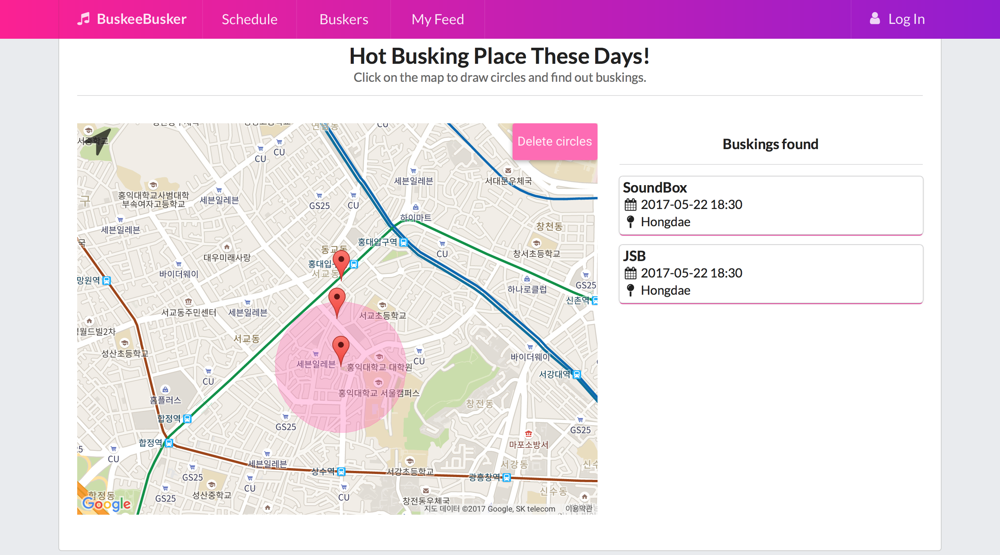
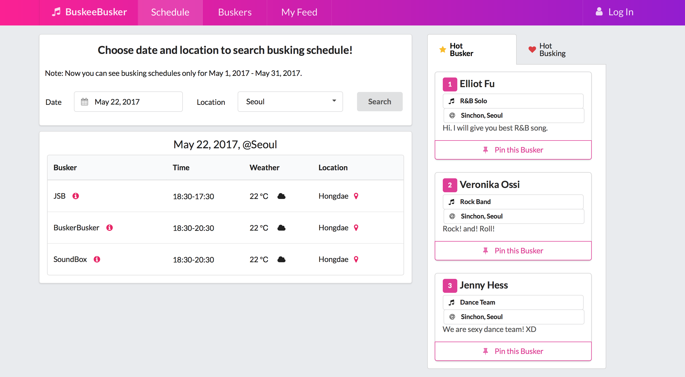
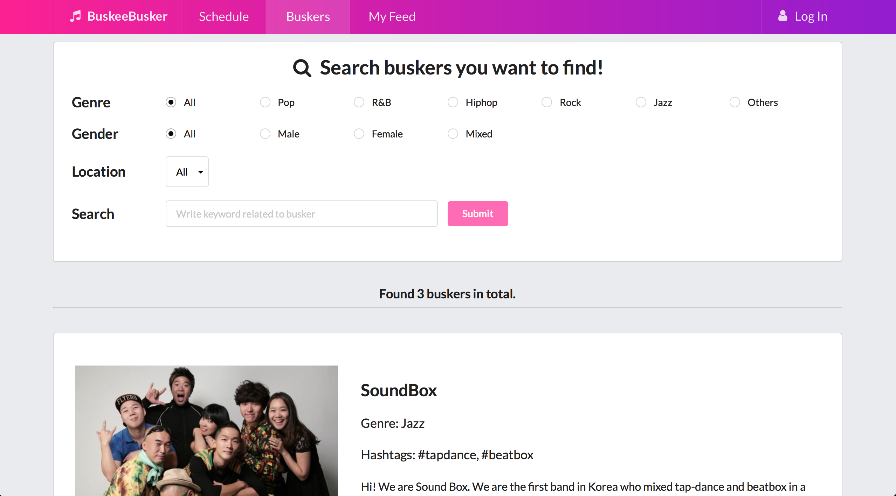
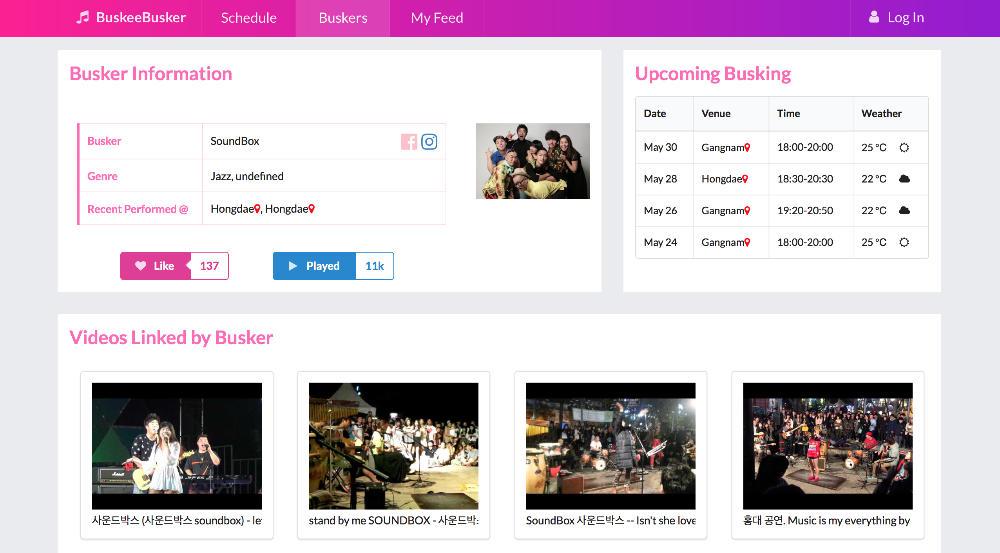
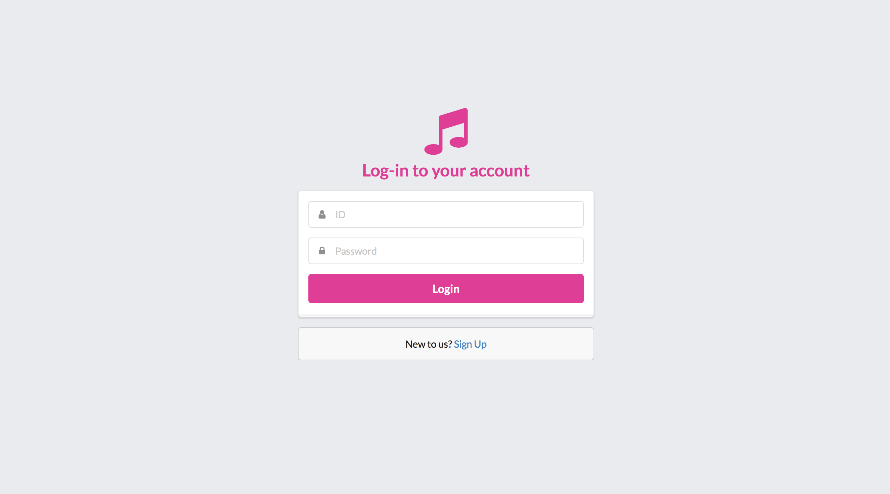
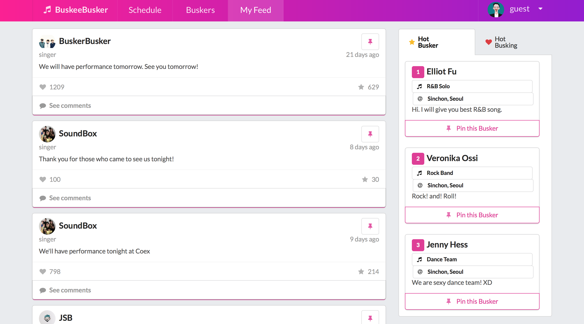
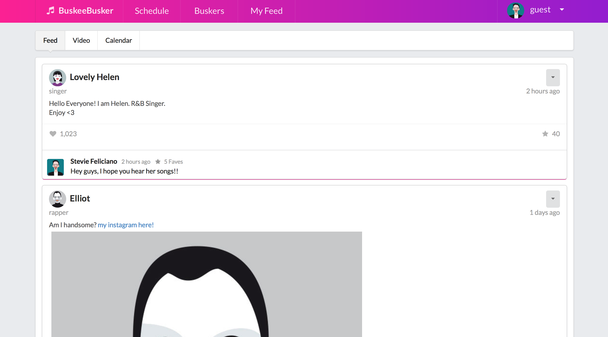

# DP4 Report  - Lo-fi Prototyping

### [MC2] Team Buskee Busker

**20140176	Hyoungseok Kim**

**20130799	Kyung Je Jo**

**20140330 	Seokchan Ahn**

**20090044 	Eun-Young Ko (audit)**

## 1. POV
A buskee who incidentally became a fan of a busker by watching the busker’s busking by chance. The buskee wishes the information on busker and its songs easily accessbile at anytime. Though the buskee has enjoyed the busking fully, it was difficult to remember the information about buskers and the songs and only the impression was lasting.
## 2. Target Users
People in twenties or thirties who like to watch buskings in the street and want to know more about information related to buskings after watching them.
## 3. Tasks
* T1: Choose a specific date or location to search for overall busking schedule and related information.
* T2: Search for favorite buskers with various tags to view their detailed information like their busking schedules or past videos.
* T3: Follow the favorite buskers and view the recent posts written by them to get information about their recent status.
## 4. Implementation Notes
### 1) URL of prototype
* https://buskeebusker.github.io/BuskeeBusker
### 2) URL of Git repository
* https://github.com/BuskeeBusker/BuskeeBusker (README last updated on 25th May, 2017)
### 3) Libraries and frameworks
* Semantic-ui 
* FullCalendar
* Google API
* Youtube API
* Firebase API
### 4) Lessons from heurisitc evaluation
#### Heuristic evaluation feedbacks from classmates - [link](https://docs.google.com/spreadsheets/d/1HOIoVmurvo-6bXSrU2jN-FwHSKflDXOiJr-pQgokbWI/edit)
Based on heuristic evaluation feedback from our classmates, we discuss about some important usability issues. To discuss this result more in depth, we re-classified each comment. While some comments pointed out usability issue on ‘not-yet-implemented’ functions (and we finally were able to implement in Hi-fi prototype), we only discuss about functions/features that already implemented but users found inconvenient. 
1. Help & Documentation 
+ While our prototype contains pages for different needs (schedule, feed, search), users needed more detailed explanation on each page. For example, some users were confused about what ‘feed’ page stands for. To address this issue, our team tried to design the UI of each page to be more intuitive. Also, we changed the naming of each page to hep user to get more clear understanding about each page’s function. 
2. Consistency & standards
+ (External Consistency) There were comments on external consistency. For example, one said that search button on right top looks like ‘play’ button and another said that clickable text with pop-up image should be distinguished with text with hyperlink. To increase the external consistency of our prototype, we replaced clickable text with text with clickable button to show pop-up image. Regarding the ‘search’ box on top-right edge, as we will discuss below, we removed the function.  
+ (Internal Consistency) There also were a number of comments regarding internal consistency. For example, some pointed out that  event check out had different button for each page/section and searchable location in schedule and search pages were not exactly same.  Also, another classmate pointed out that indentations and widths for same level of categories were different. To tackle this issue, our team members tried to concisely figure out what kind of function/features are used in common for different pages and reorganized/re-designed those features.  
3. Visibility of system status
+ A number of users pointed out that our system has to distinguishing ‘no result’ case from loading/functioning status. Users were confused when there is no busking event/busker for their schedule/busker search. We decided to include ‘No result’ notification in such case. 
From heuristic evaluation provided by our classmates, we could realize that our prototype still contains confusing/inconsistent features. Our team, who implemented the prototype and know its function/storyline well, could not know that users can be very confused or feel uncomfortable because of such ill-designed features. Moreover, we found that emphasizing our system’s characteristic while maintaining external consistency is not easy. For example, in mid-fi prototype, we had direct search box on top-right corner with ‘play’ icon for the search function. We designed the icon to be ‘play’ image as our system is about music and performance but some found out that such design is very confusing. 
### 5) Representative screenshots
#### (1) Main page: Busking search with map.

#### (2) Schedule page: Busking search with time and location.

#### (3) Buskers page: Busker search with time and location.

#### (4) Busker info page: View detailed information of selected busker.

#### (5) Login page: Login to the account. (Preliminary condition to use My feed page.)

#### (6) My feed page: View posts of “following” buskers.

#### (7) My page: View bookmarked posts, videos and vents in a user private page.

## 5. Individual Reflections
### Hyoungseok Kim
#### UI contribution
Among the pages of our prototype, I contributed to the main page and buskers page. In main page, I placed sliding images with captions to introduce our website briefly. Also, on the bottom of the main page, I provided hot busking place using google map. As it is hard for a user to pick small marker on the map, I devised a wide circle that can cover nearby events and show them on the right. If a user want to reset drawing, he can delete circles by clicking the button on the top right and draw the circles again. Also, a user can move the map to current location by clicking the location icon on the top left. This feature helps a user to find buskings that are nearby the user’s current location. In buskers page, I made searching functions based on firebase DB. With these functions, a user can search with various filter or tags to find buskers in our website. As a search result for the search, I devised busker info card that changes its border color on hovering to show that it’s clickable. If a user clicks on the card, then he can move to see the detailed information of the busker.
#### Difficulties I faced
The most difficult part I faced was to designing the main page of our website. When we first came out with Mid-fi prototype, schedule page was the first page that user encounters. However, there were a lot of feedbacks that our website needs main page. So I had to think about why the users felt uncomfortable without main page. It was really difficult to find out the users’ needs and it took me a long time to think about it. Fortunately however, after I discussed with my team members (Thanks especially to Eun-Young Ko), I could come up with enlightenment that the users’ were uncomfortable with massive information provided from the starting page. They wanted to know what our website actually does with some visualizations. Therefore, I first put image sliders to show what our website does and provided map-based busking search function. It was quite hard to came out with the solution at first, but I could overcome it with my team members.
#### Useful implementation skill
The useful implementation skills I learned are frontend design implementation with Semantic UI and backend database management using Firebase. When I first developed a website a few months ago, I tried  to develop it with pure html, css, javascript without any third party libraries. I took a long time but ended up with terrible design. However, after I learned some design principles and learned about UI frameworks like Semantic UI in HCI class, I could now develop much better website with good design. I could utilize visual design principles like contrast, alignment to the pages and finally ended up with better result. Moreover, using firebase helped me to reduce time to develop backend side and focus on frontend design. Without firebase, I should operate my own DB server and pay some money to make it work for a long time. However, I could just register it on the web and use it anytime I want. Thus, model side implementation skill with firebase was as useful as Semantic UI implementation skill.
### Kyung Je Jo
#### UI contribution
Pages that I directly contributed are busker information page and mypage. In busker’s information contains all information about busker. Main purpose of busker’s information page was to deliver as much information about busker as possible to buskees at one glance. This page largely had three segmented section. One section contains demographic information, SNS link and recent venues. It was pieces of information needed from buskees to get information scent about the busker. The right section contains upcoming busking information, displaying time, venue, and weather. This is section which buskees would like to know about their favorite buskers. Clearly displaying weather helps buskees to assess possibility of attending busking. Third section shows multiple videos of past busking. Buskees can easily scroll horizontally to see diverse videos of the buskers. Then, mypage displays whatever contents the user pins. It collectively shows the user the pinned feeds, videos. It also provides a calendar which allow the user to track their favorite events so that they cannot miss it.
#### Difficulties I faced
As just mentioned, there are too much contents I wanted to put together. There is a clear trade-off between more contents and simplicity. Thus, most challenging part of development was keeping everything simply and good-looking. I tried to involve external consistency as much as possible and use icons or images to save space and still give the same meaning. Then, it was hard to implement iframe (Google Map API and Youtube API) into a popup synchronously on multiple instances. At first, I tried to implement pop-up with independent library, tooltipster, but it had too many limitations when I wanted to use it for multiple instances. Then, I implemented by using innate popup provided by semantic-ui. 
#### Useful implementation skill
I learned how to use semantic-ui as a framework to develop front-end. I have little experience in front-end development. Throughout DP5 and DP6, I was exposed to diverse front-end implementation. It gave me an opportunity to learn more about how to use semantic-ui efficiently. Moreover, from peers’ feedback on our UI, I focused on effectively displaying buttons such as making it look clickable, giving direct and clear feedback on button event. I could effectively use semantic-ui to display all contents together such as by implementing popup for videos and keep only thumbnail on the webpage. 
### Seokchan Ahn
#### UI contribution
#### Difficulties I faced
#### Useful implementation skill
### Eun-Young Ko
#### UI contribution
I contributed to schedule page and busker’s info page (with Kyungje Jo). In schedule page, I implemented ‘search’, result part, and detailed information window (visible only by click information/map button). I implemented search function and made each buttons (information/map) can show relevant information. All of these functions uses DB stored in firebase. When I implemented the search/result part, I tried to maintain external consistency as this functions are very common in other sites. Also, when i implement right-window with buskers detailed information or map, I tried to maintain internal consistency with ‘buskers info’ page. Regarding the search page, Kyungje Jo designed the page and implemented features and I made each page for different artists can have different, busker-specific information - from DB, the busker info page should get each buskers image, name, genre, video, or upcoming busking schedules. 
#### Difficulties I faced
During the implementation, I faced number of difficulties.  First of all, I have to design the schedule page to contain many useful information about busking performances while avoiding give users high cognitive load. Based on our team discussion, we found that the most useful information to buskee is buskers name, schedule, location, and weather. I tried to lower users cognitive load by hiding some detailed information about busker or the location so that user only sees the details only when they click on information button or map button in the search result.  Secondly, I and Kyungje Jo was sufferd for implementing pop-up window with busking-event-relevant location information. While showing event-specific map in schedule page, using google API, was doable, showing pop-up at the cursor was bit more technically challenging.  
#### Useful implementation skill
As it was my first experience on developing websiet (wth html and js), I could learn a lot of different skills in this implementation steps. However, I will only point out three skills that I fould really useful. First of all, I could learn about ‘binding’ in java script - when I implemented function that iterate list of elements (buttons) and define onclick function on each, the intended onclick event did not showed up for non-last elements. Hyoungseok Kim helped me to handle this issue. Second, the use of firebase DB and synchronizing it. I could learn how json data structure can be constructed and used in js. Also, when I first implemented ‘like’ button in busker’s info page, the effect of clicking like button was reflected only when I reloaded the page. Thanks to Kyungje Jo, I could learn how I can synchronize click effect without reloading the page. Third, while implementing location detailed information window in schedule page, I could experience google map API. With google map API and stored geocode for each busking location, I could draw a map with marker at specified busking location and automatically get text address for the point.
## 6. Studio Reflections
There are many feedbacks, and also we tried to deduce the meaning implied by the some lack of refined feedback. Thus, we can categorize given feedbacks. You can see whole feedbacks via this [link](https://docs.google.com/document/d/1x68XSaKc6Oak8xyVP3RB4bF0DZM2MowFjqpAxLr0Xkc/edit).
### 1) “Likes” Feedback
#### a) I like your high-fi prototype, which is well implemented most of key functions of your works!
### 2) “Wishes” Feedback 
#### a) I wish that some buttons looks more/less clickable...
+ i) In the busker information page, ‘Facebook’ button 
+ ii) In the schedule page, ‘Like’ Button
+ iii) In Schedule page, the Like button in busker information looks like clickable.
+ iv)  Some other clickable buttons are too small, hard to click
#### b) I wish more visual sugar...
+ i) Maybe have some horizontal lines for the calendar?
+ ii) Some dropdown go over the edge of the page. 
+ iii) On video tab, video is too small to watch.
#### c) I wish more user consideration...
+ i) On the schedule page, I tried to click a name of Busker and a name of Location, but it is not clickable.
+ ii) In the index page, beside the map in the events found section, I want to click those events. 
+ iii) On radio buttons, clicking radio is working as selection but label (ex: Pop) is not.
+ iv) In the main page, can the order of the slides be buskee, busker and buskeebusker. i think it’ll be more intuitive.
+ v) Also, in my feed page, I cannot distinguish the pin this busker and busking functions. It would be better to show short explanations of small functions.
+ vi) In home page, I don’t know the ‘Delete circles’ button does
#### d) I wish better implementation...
+ i) The like button shows the value “1” for a short time. was this intended?
+ ii) First login is malfunction.
+ iii) Search with genre as keyword is not working. e.g. Search “Jazz” doesn’t show SoundBox as result.
+ iv) Clicking numbers next to “star” and “heart” is not working
+ v) Drawing circle’s size is not limited, so I can draw that covers earth.
+ vi) If you are using youtube, perhaps link it with a google id?
There is no redirection to homepage when sign out
#### e) I wish more functions...
+ i) In the busker info page, I want the buskers to write down their description.
+ ii) In the busker info page, I want to see their past busking information as well.
### 3) Our reflection
#### Overall reflection
There was feedbacks on a visual (affordance) part in the ui side, errors and more functionality requests. We are primarily satisfied with this. Because there was no feedback that somebody do not know which components function in the ui aspect. This is the most nervous part of the development, because the importance of information scent to prevent new users from clogging. Also, for more functionality requests, we will consider its priority is lower than feedback on ui, but will add as much as possible from important functions.
#### Reflection to each category
* (a.i) Thank you for a feedback. We tried to implement all functions we thought.
* (b.i) We checked there were a lot of button visuality issues. Thus, we first made a clear distinction between labels and buttons, and we decided on a visual convention for clickable and unclickable buttons. It might be caused by re-use other teammates’ code.
* (b.ii) We talked a lot about the visual aspects of the development process, but we found that there may be some shortcomings in the specific areas. As long as it is subjective feedback, we will discuss it for the remaining period and decide whether to reflect it.
* (b.iii) We think user consideration is also an important part. I learned what part of KAIST students were unfriendly to write. I will reflect some important feedbacks right away, but I think that other feedbacks should be checked to see if there is a lack of consideration for the target user.
* (b.iv) We think that malfunction should be the first priority because it is bad for the user experience. There was also feedback on features that were planned due to time constraints but not developed, and there was also advice on development. 
* (b.v) We think these new functions are good. Because these functions are aligned with our POVs and Tasks. Thus, after reflect the ui feedback, we add these functions to our Service.