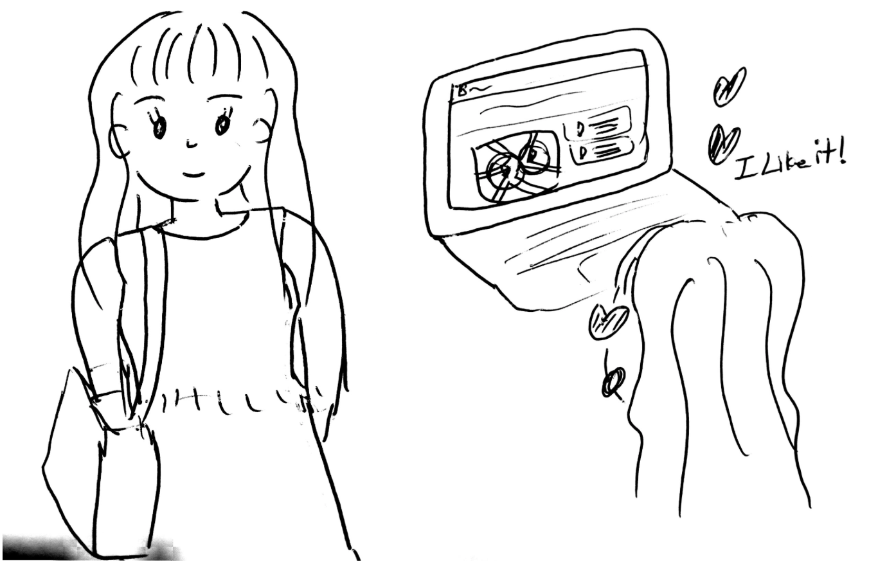

# DP7 Report  - User Testing

### [MC2] Team Buskee Busker

**Hyoungseok Kim 20140176**

**Kyung Je Jo 20130799**

**Seokchan Ahn 20140330**

**Eun-Young Ko (audit) 20090044**

## 1. Written protocol
### Preparation and setting information
* Website URL - [https://buskeebusker.github.io/BuskeeBusker](https://buskeebusker.github.io/BuskeeBusker)
* Need login for full feature access
    * Guest ID: guest
    * Password: buskeebusker
* Environment - Latest Google Chrome (desktop)
### Introduction
1. Our service BuskeeBusker is the website that helps to find buskings and related busker information. We are doing user testing to get the feedback to improve the usability of our service.
2. In this system, you can basically (1) search busking schedule with date/location and see more detailed information, (2) search busker with their genre/gender/location or other keywords, and (3) get information from your favorite busker. 
3. You will be given some specific tasks to do and also will use our service as you want. We will make an observation about how you use/ face difficulties while using our service and this observation will help us to improve our service. 
4. After the use-session, we will ask few questions to you regarding your experience of using our service. 

### Task & Instruction
#### Informed Consent
We’re collecting
1. The approaches of searching buskers/busking through screenshot, written notes.
2. General information such as which button/tab they click in which order, but no personal information such as which busker they choose, which video they watch. 
3. Testing should take about 5 minutes.

#### Instruction
Our service BuskeeBusker is the website that helps to find buskings and related busker information. We are doing user testing to get feedback to improve the usability of our service. Use our service in freely for 5 minutes and try each tasks.

Task 1 - Choose a specific date or location to search for overall busking schedule and related information.
* Pick any date in May and see which buskers have busking schedule on that day in Seoul.
* Pick any busker on the schedule table, try to get more detailed information about them. 
* Pick any busking event on the schedule table, try to find exact address for busking place. 
 
Task 2 - Search for favorite buskers with various tags to view their detailed information like their busking schedules or past videos.
* Search a busker with R&B genre
* Search a busker who play near Hongdae
* Search a busker with both male and female
* Search a busker who is famous for guitar 
* From busker found from 4 items above, explore more detailed information for them. 
* From busker’s personal page, try to see a busking video of him 
* From busker’s personal page, try to give ‘like’ to the busker
 
Task 3 - Follow the favorite buskers and view the recent posts written by them to get information about their recent status.
* Login to account with given id/pw
* Read the busker’s posts/busking event notification 

### Tutorial
No tutorial is needed

### Recording Strategy
Screen recording
* Record the screen with which the user is interacting.
* Use OBS(Open broadcaster Software) for screen recording.

Writing notes
* Note the behavior of users in each step.
* Check if there is any critical incidents.

### Questionnaires and Interview Questions
Add more questions specified on each tasks + comparison with existing services (e.g. Indistreet)

Task 1
* Was it easy to find busking on specific date?
* Was there any information you wished to see in schedule table?
* Were there any information that seemed unnecessary in the table: Busker, Time, Weather, Location?

Task 2
* Was it easy to search for a busker? Please answer either “yes” or “no”
* Did radio buttons easy to filter? If not, do you have any preference of other style and why?
* Was there any information you wanted to see in busker’s personal page that were not provided?

Task 3
* Was it easy to find log-in button and to log-in?
* Were buskers’ feeds well-displayed and readable?
* Was my page helpful to remember pinned busking events, videos or posts?

Overall
* If you have ever used similar service such as “Indistreet”, please comment with one distinction and one similarity, which one you prefer and why.
* Were there anything that did not work as you expected?
* Do you think the service is easy to use? Why?

### Debrief Prompt
In respective order,
1. Thank you for attending the user testing.
2. During and after the use, you have pointed out [~], [~], and [~] are malfunctioning/inconvenient. It was very helpful to hear from you about our system’s weakness . We will try to reflect your feedback to improve our system.

## 2. Session observation
### Session 1

#### Participant
* He is a friend of Hyoungseok Kim, who push likes to many busking videos and sometimes share busking/singing video from ‘일반인의 소름돋는 라이브' page. We directly asked him for an user testing and offered him a cup of coffee. 
* He is our target user because he enjoy to discover buskers performance. 
* Demographic information
    * Gender: male
    * Age: 22
    * Occupation: Undergraduate
    * Region: Daejeon, Seoul
* Context information
    * Likes to sing and listening/watching other people singing. 
    * Follow some buskers facebook page in Facebook. 
    * Follow ‘일반인들의 소름돋는 라이브’ page in Facebook and use it to find excellent buskers/singers
#### Summary of session 
* His level of interest about unpopular buskers was surprising. He has high interest of busking performances and has need to get ‘consistent’ feed on busking related informations. 
* He valued the ‘feed’ feature and ‘detailed information’ feature the most. He especially liked the video’s.  He pointed out many mal-function or inconvenient features mostly on feed page. 
* He wanted more ways to pin/like busker or their performance. For example, he wanted to pin or add buskers to his favorite busker lists from schedule page. 
* He was unsatisfied by limited DB we currently hold - we explained why we currently have limited DB. 
 
### Session 2

#### Participant
* He is a friend of Eunyoung Ko and acquaintence of other team members. He visited campus for campus-recruiting related events and we directly asked him for an user testing and offered him a cup of coffee. 
* He is our target user because he enjoy to discover not-yet-popular instrument player and tracking his period of growth. 
* Demographic information
    * Gender: Male
    * Age: 27
    * Occupation: Businessman and Developer
    * Region: Seoul, Bundang
* Context information
    * Interested in buskers who can play music instruments very well. He really enjoys jazzy performance.
    * It was great experience for him to get to know young, not popular piano player few years ago and watching how the player become more popular over time. 
#### Summary of session 
* He gave a lot of usability issue that he discovered - twice more than other participants. 
* His comments on usablity were mainly about status, consistency or ‘defaul’ settings. For example, resetting some status or get ‘current location’ in map directly.  He wanted more ways to pin/like busker or their performance. For example, he wanted to pin or add buskers to his favorite busker lists from schedule page. 
* He suggested that it would be great to see more statistics about buskers. 

### Session 3

#### Participant
* She is a friend of Kyungje Jo who likes to enjoy busking performance by chance. We directly asked her for an user testing and offered her a cup of coffee. 
* Demographic information
    * Gender: Female
    * Age: 23
    * Occupation: Undergraduates
    * Region: Seoul, Daejeon
* Context information 
    * She enjoy hanging around near hongdae place in weekends while dating with her boyfriend.
    * She and her boyfriend are very willingness to stop by a busking place and spend 10-20 minutes to watch the performance. She thinks it is great to know near busking places as she and her boyfriend sometimes are not sure what to do while waiting for movie (in theatre) to start or restaurant to open after break time. 
#### Summary of session
* She valued the main page (map-based current busking search) the most. She said it would be great if she can do map-based search for not-current busking performance. 
* She said that she wants more detailed information from ‘hot’ or ‘recommended’ buskers or buskings. 
* She, who does not follow buskers intendedly but very willing to watch their performance, wants more ‘on-time’ or ‘close-future’ event information. 

## Usability lessons
### Usability problems
We observed user testing process from three users and derived usability issues from them. There were total 11 usability issues in the process and we analyzed them by giving critically of High, Medium and Low. We used three standard criteria, which are written below, to determine criticality.

* Criticality criteria
    * How many participants mentioned an issue? 
    * How much do other functions affected by a mentioned issue?
    * How much benefit would target user get if this issue is tackled?

Task 1: Choose a specific date or location to search for overall busking schedule and related information.
* High: On main page, it’s not possible to see the busking events of other days. (P1, P3)
* Medium: On main page, “move to current location” button is not recognizable. (P2)
* Medium: On schedule page, it’s not possible to pin the buskers on hot busker tab. (P1)
* Low: On schedule page, It’s not possible to click on the busker box in hot busker tab and get the detailed info of the busker. (P3)

Task 2: Search for favorite buskers with various tags to view their detailed information like their busking schedules or past videos.
* High: On busker info page, there is strange text “undefined” on genre information. (P2, P3)
* Medium: On buskers page, it’s not possible to check on multiple options. (P2)
* Low: On busker info page, pink facebook button doesn’t seems to have external consistency. (P2)

Task 3: Follow the favorite buskers and view the recent posts written by them to get information about their recent status.
* High: On my feed page, it’s not possible to comment on the posts. (P1, P2, P3)
* Medium: On my feed page, “Pin this Busker” seems unnecessary because buskers appear on the page are already pinned. (P2)
* Medium: On my feed page, it’s hard to know the difference between heart and star icon. (P1)
* Medium: On my page, there is no way to unpin the pinned posts. (P2)

### Plan to improve
For each tasks, we defined criticality for each usability issues with the level High, Medium and Low. As higher level of criticality means higher importance to our system, we are going to solve higher level criticality issues first. The specific plans for each usability issues are written below. 

1. Add date selector on the main page to make user select the date for map.
2. Change the color of “move to current location” button to make it more visible.
3. Implement pin busker functionality in hot busker tab.
4. Make busker box clickable and link it to detailed busker info page.
5. Delete undefined genre information stored in database and also check it on client side code.
6. Make it possible to check on multiple options. But we would consider more about this issue because it might decrease usability in some cases.
7. Change facebook icon color to blue to maintain external consistency.
8. Add comment function to busker posts to enable interaction between busker and buskee.
9. Delete “Pin this busker” option because this option is not needed in the page.
10. Delete star icon on the post because star icon has overlapping meaning with heart icon.
11. Make it possible to unpin the already pinned post.

### High-level reflections
The primary lesson we learned from user testings is that more user testing gives more chance to improve the product. So far, we have gone through many user testings in paper prototyping and mid-fi prototyping phase and got useful feedbacks. We have discussed a lot and tried hard to address issues came out from user testings. So, we are slightly confident at the user testing of DP7. However, when we actually conducted the user testing, there were still a lot of usability issues found by users. We realized that even though we have improved our product a lot, we still have to put more effort on addressing usability issues. Therefore, we learned there is no exact end for user testing. More user testing gives us a more chance to improve our product to meet users’ needs.

## Plan for iteration
### High level goals
* Address existing usability issues of our product with specific plans.
* Add tutorial for users who are not familiar with English.
* Get feedbacks and evaluations from target users.

Considering we have only one week, we defined three main goal to finalize our design process. We primarily considered two main perspectives. First, we considered product perspective. As we have collected a set of usability issues for our product in user testing, we would focus on addressing these usability issues. The specific plan to address those issues are introduced in section 3. Usability lessons.

Second, we also considered user perspective. When we conducted user testing, we found that users who are not familiar with English felt uncomfortable when using our product. So we thought that it’s necessary to add some kind of tutorial for those users. We would consider about this issue more and we would add tutorial that would help these users. The one concrete way we are thinking now is to add short Korean introduction on the start of our website.

Finally, after achieving two main goals of two perspectives, we would try to get feedbacks and evaluations from target users. As we have to evaluate our product both qualitatively and quantitatively, it would be helpful to ask target users about our final product. But the problem is that it would be tight to achieve all high level goals. So we would primarily focus on first two high level goals, and then if there is remaining time, we would finalize our product with user evaluation.

## Studio Reflections
### “Likes” Feedback
a) Qualitative question 

### “Wishes” Feedback
a) It would be better to compare with other services/possible ways for the same ‘goal’ question

b) Map interview questions with tasks

c) Add information about time in informed consent

d) I am worried how you would gather target users

### Our reflection
#### Overall reflection
Firstly, we were satisfied since there were no serious feedback on our user testing method. Moreover, feedback helped us to be more prepared to get better results from user testing. Especially, we mapped our questions to each tasks from feedback b). This helped us identify usability issue separately from each tasks.

#### Reflection to each category
a) We added a question to ask user to compare our service with existing ones such as “Indistreet”

b) We reorganized interview questions and categorized them into each tasks

c) We added the information in informed consent about expected time taken in user testing.

d) We have extensively asked many friends of ours and have enough potential users for testing